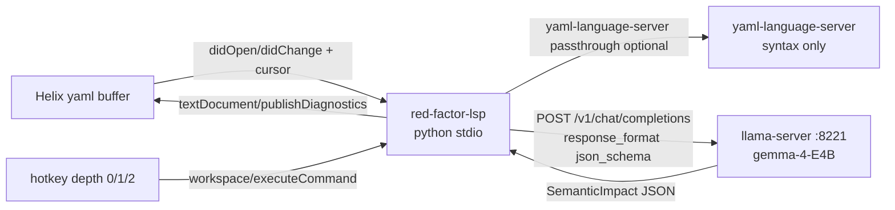
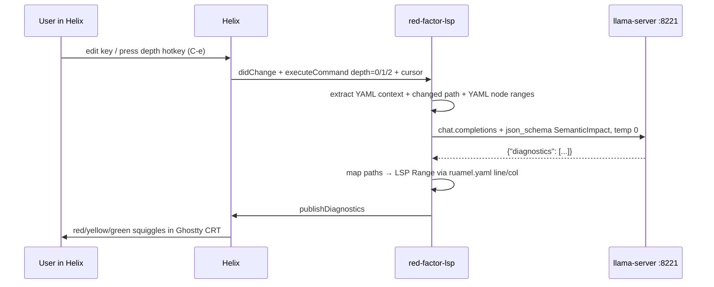

# Red Factor Retract — Design Spec (Helix + llama.cpp)

Goal: semantic blast-radius highlighter for **any YAML**, not syntax checking.
Edit one key → see downstream relational impact as red → green.

Validated env 2026-10-01:
- `helix 25.07.1` via brew, `hx --health` OK
- `llama-server` on `127.0.0.1:8221`, model `gemma-4-E4B_q4_0-it.gguf`, OpenAI-compatible, `response_format: json_schema` works
- Python 3.14.7, Ghostty.app present

Gemini seed was directionally right, wrong on runtime. This spec corrects it for llama.cpp.

## 1. Concepts

- **Red Factor Retract:** highlight cascading relational impact *before* you type.
- **DeepLeaf:** inference-depth throttle on a hotkey. Tap = shallow, hold/deeper = full relational chew.
- **Blast radius:** 0.0 (safe/isolated) → 1.0 (breaks resolve).

Color decision: **red = danger/break, green = safe**. Standard dev psychology. Yellow in middle for suspect.

Helix only renders 4 diagnostic severities, no true gradient. Map impact → severity:

| impact | severity | color in most themes |
|---|---|---|
| 0.8–1.0 | error | deep red |
| 0.5–0.8 | warning | yellow/orange |
| 0.2–0.5 | information | blue/green tint |
| 0.0–0.2 | hint | faded/green, or no diagnostic |

CRT look comes free from Ghostty shader + Helix theme. No editor work needed.

## 2. Architecture



Dual-LSP in `~/.config/helix/languages.toml`:

```toml
[[language]]
name = "yaml"
language-servers = ["yaml-language-server", "red-factor-retract"]

[language-server.yaml-language-server]
command = "yaml-language-server"
args = ["--stdio"]

[language-server.red-factor-retract]
command = "red-factor-retract"
args = []
environment = { "RFR_LLM_URL" = "http://127.0.0.1:8221/v1/chat/completions", "RFR_MODEL" = "gemma-4" }
```

Helix merges `diagnostics` from all servers. Use `only-features = ["diagnostics"]` for yours if you want to suppress hover/completion noise:

```toml
language-servers = ["yaml-language-server", { name = "red-factor-retract", only-features = ["diagnostics"] }]
```

## 3. Sequence — DeepLeaf hotkey flow



Hotkey example `~/.config/helix/config.toml`:

```toml
[keys.normal]
C-e = ":run-shell-command red-factor-depth.sh 1"
C-E = ":run-shell-command red-factor-depth.sh 2"
# or workspace command if LSP implements it:
# C-e = ":lsp-workspace-command redFactor.setDepth"
```

Simplest v1: hotkey just re-saves / touches file with `RFR_DEPTH` env, server reads depth from last `executeCommand`. No Helix plugin needed.

Depth meaning:

- **0 minimal:** only siblings + direct children of edited key, ~400 tokens, <300ms target.
- **1 normal:** whole file, resolve anchors/merge keys, ~2000 tokens.
- **2 DeepLeaf:** whole file + constraint knowledge (provider capability table), ~4000 tokens, allow 2-4s.

## 4. llama.cpp contract (validated)

Works on your box today:

```bash
curl -s http://127.0.0.1:8221/v1/chat/completions -H "Content-Type: application/json" -d '{
  "model": "gemma-4",
  "messages": [{"role":"user","content":"Say hi"}],
  "response_format": {"type":"json_schema","json_schema":{
    "name":"T",
    "schema":{"type":"object","properties":{"greeting":{"type":"string"}},"required":["greeting"],"additionalProperties":false}
  }},
  "temperature": 0
}'
# -> {"choices":[{"message":{"content":"{\"greeting\":\"Hi there!\"}", ...}}]}
```

Notes:
- Parse `choices[0].message.content` as JSON. Ignore `reasoning_content`.
- Flatten `$defs/$refs` before sending — llama.cpp grammar chokes on refs (see ggml-org issues #20178, #21537).
- Fallback: if `json_schema` 500s on a template, retry with `{"type":"json_object"}` + manual `json.loads` + repair pass.
- Always `temperature: 0`, `stream: false`.

Python sketch (stdlib + `requests`, no ollama lib needed):

```python
import json, urllib.request
schema = {
  "type":"object",
  "properties":{
    "diagnostics":{"type":"array","items":{
      "type":"object",
      "properties":{
        "path":{"type":"string"},
        "impact":{"type":"number"},
        "severity":{"type":"string","enum":["error","warning","information","hint"]},
        "message":{"type":"string"},
        "related_field":{"type":"string"}
      },
      "required":["path","impact","severity","message"],
      "additionalProperties":False
    }}
  },
  "required":["diagnostics"],
  "additionalProperties":False
}
body = {
  "model": "gemma-4",
  "temperature": 0, "stream": False,
  "messages": [
    {"role":"system","content": SYSTEM_PROMPT},
    {"role":"user","content": user_payload}
  ],
  "response_format": {"type":"json_schema","json_schema":{"name":"SemanticImpact","schema":schema}}
}
req = urllib.request.Request("http://127.0.0.1:8221/v1/chat/completions",
  data=json.dumps(body).encode(), headers={"Content-Type":"application/json"})
resp = json.loads(urllib.request.urlopen(req, timeout=20).read())
data = json.loads(resp["choices"][0]["message"]["content"])
```

## 5. Prompts

SYSTEM (keep short for 3-7B speed):

```
You are a semantic dependency analyzer for YAML config files.
Analyze the YAML and the proposed change. Identify conflicting downstream fields, invalid provider parameters, or logical breaks.
Return ONLY JSON matching the schema. No prose.
Focus on relational impacts, not syntax. Use dot paths like tts.provider.
impact 0-1: 1.0 = will break resolve, 0.0 = isolated.
```

USER template:

```
Depth: {0|1|2}
Changed: `{changed_path}` from `{old}` to `{new}` cursor line {line}
YAML:
```yaml
{yaml_text}
```
Known constraints (depth 2 only):
{constraint_table}
```

Constraint table v1 is just a static JSON you curate, e.g. `xai: {formats: [mp3,wav], no: [ogg]}`. Model hallucinates less when you give it ground truth. Don't rely on model to *know* XAI has no OGG.

## 6. Coordinate translation

Model returns `path` like `tts.format`, not lines. Server must map:

1. Parse YAML with `ruamel.yaml` (preserves line/col) or `yaml.composer`.
2. Walk dot path to node, get `lc.line/lc.col`.
3. Emit LSP: `{"range":{"start":{"line":l,"character":c},"end":{"line":l,"character":c+len}},"severity":1-4,"message":...,"source":"red-factor"}`.
4. Severity int: error=1, warning=2, info=3, hint=4.

If path not found (model invented key), drop diagnostic + log. Never crash publish.

## 7. Worked example — Hermes TTS

Input:
```yaml
tts:
  provider: xai
  format: ogg
  voice: aura-asteria-en
```

Change `provider: elevenlabs -> xai`, depth 2.

Expected model output:
```json
{"diagnostics":[
  {"path":"tts.format","impact":0.95,"severity":"error","message":"xai does not offer ogg; use mp3/wav","related_field":"tts.provider"},
  {"path":"tts.voice","impact":0.6,"severity":"warning","message":"aura-asteria-en is an ElevenLabs voice, verify xai mapping","related_field":"tts.provider"}
]}
```

Helix renders `ogg` line deep red, `voice` yellow. Rest stays green = safe.

## 8. Minimal LSP surface (python, stdio, no deps beyond stdlib+pyyaml)

Implement JSON-RPC over stdio:
- `initialize` → `{capabilities:{textDocumentSync:1, executeCommandProvider:{commands:["redFactor.setDepth"]}}}`
- `initialized`, `textDocument/didOpen`, `didChange`, `didSave` → debounce 300ms → infer → `publishDiagnostics`
- `workspace/executeCommand` → set depth 0/1/2
- `shutdown/exit`

~250 lines. No `pygls` required for v1, keeps it auditable.

Debounce + cache: hash YAML + changed path + depth. Don't hammer :8221 on every keystroke. Only infer on save or hotkey in v1.

## 9. Risks / open calls

- 7B gemma will hallucinate provider caps → mitigate with static constraint table, impact threshold <0.2 suppressed.
- Reasoning models + grammar = slow/brittle → keep temp 0, short prompts, depth throttle.
- Helix diagnostics merge can double-report with yaml-language-server → use `source: red-factor` + distinct messages, or disable yaml LS diagnostics if noisy.
- Privacy: all local, YAML never leaves box. Log redaction for secrets in v2.

## 10. Next build steps (when you want code)

1. `scaffold red-factor-retract` python stdio LSP (~250 lines).
2. `languages.toml + config.toml` hotkeys.
3. Constraint table `providers.json` (xai, elevenlabs, openai TTS).
4. Test on Hermes YAML, tune prompts.
5. Optional: inlay hints / codeLens for impact scores.

No further installs needed for prototype beyond `pip install pyyaml ruamel.yaml` (or stdlib only).
